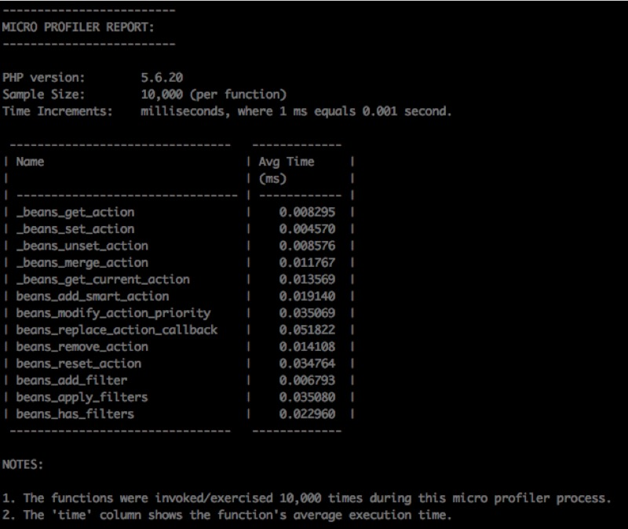
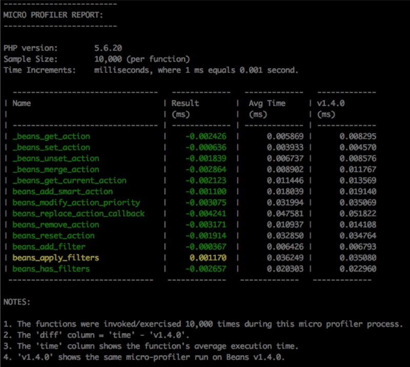

# Beans Profiler

This plugin provides a micro profiler to measure the current execution time of each function being profiled against a baseline.  

Why?  When we make changes to the codebase, we want to measure if those changes impacted its execution time.

How do we do that? We capture the results of the affected function/code _before_ we make changes.  This is our baseline.  Then you make your changes and run the profiler.  It will exercise the new code and compute it's average execution time in milliseconds.  That time is then compared to the original baseline.

NOTE: This plugin is in development.

## How to Run

We use composer to run the profiler.  When you initiate it, be patient, as it takes a couple of minutes to run.  Why? We are running 10,000 cycles for each profiled function in order to gather a proper sample and average.

### Step 1: Run the Baseline

The first step is to run the baseline, as we need these results to measure changes against.

Open up your command line app.  Then type:

```
composer run-baseline-profiler
```

You'll get a report similar to this one:



### Step 2: Make Your Changes

The next step is to create a branch and make your changes to the code.

### Step 3: Run the Profiler

Now, let's measure the changes you've made.  Open up your command line app.  Then type:

```
composer run-profiler
```

You'll get a report similar to this one:



## Installation

1. Clone or download this plugin and store it into your development's `wp-content/plugins` folder.
2. Open your command line app.
3. Navigate to the plugin.
4. Type: `composer install`.
5. Make sure you have a copy of the Beans framework installed in your `wp-content/themes` and that it's folder name is 'tm-beans'.
6. Install a copy of Beans 1.4.0 by storing in this folder `wp-content/themes/beans-v1.4.0`.

Bam, you're ready to profile.
